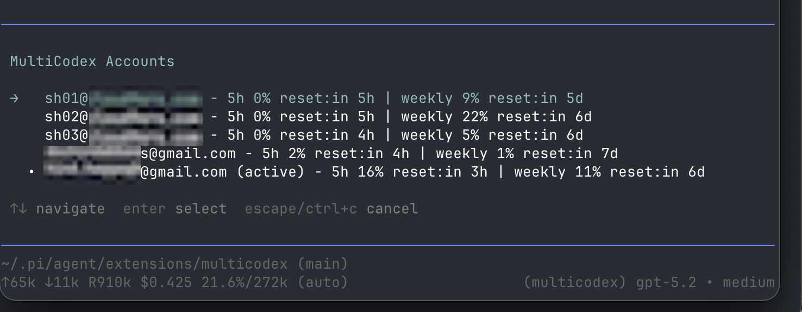

# MultiCodex Extension



MultiCodex is a **pi** extension that lets you use **multiple ChatGPT Codex OAuth accounts** with the built-in **`openai-codex-responses`** API.

It helps you **maximize usable Codex quota** across accounts:

- **Automatic rotation on quota/rate-limit errors** (e.g. 429, usage limit).
- **Prefers untouched accounts** (0% used in both windows) so fresh quota windows don’t sit unused.
- Otherwise, **prefers the account whose weekly window resets soonest**.

## Install (recommended)

```bash
pi install npm:pi-multicodex
```

After installing, restart `pi`.

## Install (local dev)

From this directory:

```bash
pi -e ./index.ts
```

## Quick start

1. Add at least one account:

   ```
   /multicodex-login your@email.com
   ```

2. Use Codex normally. When a quota window is hit, MultiCodex will rotate to another available account automatically.

## Commands

- `/multicodex-login <email>`
  - Adds/updates an account in the rotation pool.
- `/multicodex-use`
  - Shows every account's usage and active status, then lets you pick an account for the current session (until rotation clears it).
- `/multicodex-analyze`
  - Shows request activity as a GitHub-style heatmap. Use left/right to cycle through all accounts, the first account, the second account, and so on. Calendar weeks run Monday through Sunday.

## How account selection works (high level)

When pi starts / when a new session starts, the extension:

1. Loads your saved accounts.
2. Fetches usage info for each account (cached for a few minutes).
3. Picks an account using these heuristics:
   - Prefer accounts that are **untouched** (0% used in both windows).
   - Otherwise prefer the account whose **weekly** quota window **resets soonest** (5h window is ignored for selection).
   - Otherwise pick a random available account.

When streaming and a quota/rate-limit error happens **before any tokens are generated**, it:

- Marks the account as exhausted until its reset (or a fallback cooldown)
- Rotates to another account and retries

## Usage ledger

MultiCodex appends structured records to:

```text
~/.pi/agent/multicodex-usage.jsonl
```

It writes one `request` record for every completed or failed provider request. The
record includes the account, model, reasoning level, duration, status, and the
provider-reported input/output/cache tokens and API-equivalent cost. It does not
include prompts, responses, or credentials.

It also writes a `quota_snapshot` record whenever a successful usage API request
refreshes an account's quota. These records include each available window's used
percentage, duration, and reset time. Correlating request records with snapshots
can provide an empirical estimate of quota consumption, but OpenAI does not expose
the official token-to-subscription-quota conversion.

Example records:

```json
{"version":1,"type":"request","timestamp":"2026-08-07T12:00:00.000Z","requestId":"...","attempt":0,"account":"user@example.com","model":"gpt-5.6-sol","reasoning":"medium","status":"done","stopReason":"stop","quotaError":false,"durationMs":12345,"usage":{"input":15230,"output":1840,"cacheRead":12100,"cacheWrite":0,"totalTokens":17070,"cost":{"input":0,"output":0,"cacheRead":0,"cacheWrite":0,"total":0}}}
{"version":1,"type":"quota_snapshot","timestamp":"2026-08-07T12:01:00.000Z","account":"user@example.com","primary":null,"secondary":{"usedPercent":42.5,"resetAt":1786176633000,"limitWindowSeconds":604800}}
```

Configuration:

- `MULTICODEX_USAGE_LOG_FILE=/path/to/usage.jsonl` changes the location.
- `MULTICODEX_DISABLE_USAGE_LOG=1` disables usage logging.

## Checks

```bash
npm run lint
npm run tsgo
npm run test
```
